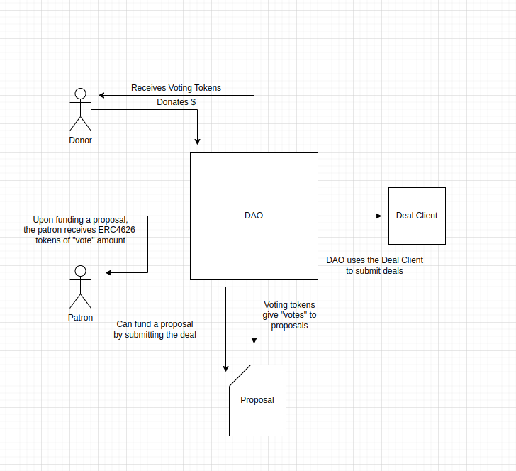

# Purpose
This project acts as a Filecoin Data DAO to encourage the storage of in demand public data as determined proportionally by donors. This can be thought of as a sort of decentralized patronage system whereby donors are given voting tokens which can incentivize "patrons" to actually pay for the hosting of data. This incentive lies in the form of the donations themselves, which are split among the patrons using ERC-4626. 

In short: Patrons act as shareholders of the DAO, and donors get the voting rights to direct patrons to pay for the hosting of data they find valuable

# Structure
The project consists of the following parts:
- Deal Client
- DAO
- Vote

## Deal Client
A contract provided by the Filecoin tutorial as a way to submit DealRequests

## DAO
The meat and potatoes. The DAO contract contains ERC-4626 logic, as well as hosts DealRequest proposals and their vote information

## Vote
An ERC-20 token mintable and burnable by the DAO

## Donor flow
- Donate 10 tokens to the DAO and receive 10 vote tokens
- Vote 8 tokens on proposal 1 and 2 on proposal 2

## Patron flow
- Notice proposal 1 has 8 votes and 2 has 2 votes
- Call fundProposal() and receive back 8 "DAO" tokens
- Assuming there are 8 other DAO tokens in existence, this patron owns 50% of the vault
- The patron can now collect 5 of the donated tokens or continue to hold and collect further donations proportional to their share